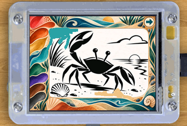

# Device Envoy CYD starter

[](https://carlkcarlk.github.io/device-envoy-cyd-starter/)

[*Run app in the browser*](https://carlkcarlk.github.io/device-envoy-cyd-starter/)

The Cheap Yellow Display (CYD) is an inexpensive ESP32 development board with
a built-in color touchscreen. This repository is a ready-to-run Rust starter
for the classic CYD (`ESP32-2432S028R`).

The [Device Envoy](https://crates.io/crates/device-envoy-esp) crate makes it easier to
write higher-level Rust applications that run bare metal, without an operating
system. For the CYD, it provides access to the display, touchscreen, button,
and storage, plus browser simulations for testing and demonstration.

This project starts as a touchscreen paint-book application. First
run it unchanged in your browser or on the physical board, then replace the
application code  in [`src/app.rs`](src/app.rs) with whatever you want to build.
The hardware and software setup in [`src/main.rs`](src/main.rs) can stay unchanged.

## Try the live browser demo

**[Open the live CYD paint book](https://carlkcarlk.github.io/device-envoy-cyd-starter/)**

The browser simulator runs the same application code as the physical board.
Click or drag on its touchscreen to use it. No hardware or software installation
is required for the browser version.

## What the paint book does

Start a stroke on a color and drag it into the picture. The paintbrush picks
up the color under your first touch, so anything you have already painted becomes a new color source. There is no separate palette.

Touch the folded corner to switch between the crab-beach, dog-walk, and cave-art
pages. The selected page is saved and survives a restart. On the physical CYD,
Device Envoy guides you through touchscreen calibration on the first boot.

The paint book is deliberately small enough to replace. It demonstrates:

- drawing into a full-screen frame and reading pixels back for color pickup;
- Device Envoy touchscreen calibration and orientation-correct touch input;
- optionally, writing text to the screen;
- bitmap assets compiled into the program;
- saving a typed value in flash storage; and
- running the application on ESP32 hardware or in a WebAssembly browser simulator.

## Get the supported CYD hardware
This starter should work with any classic Cheap Yellow Display
(`ESP32-2432S028R`, with an `ILI9341` display and `XPT2046` resistive touch).

This is the board and case I personally bought:

- [2.8-inch ESP32-2432S028R board](https://www.amazon.com/dp/B0BVFXR313)
- [Optional acrylic case](https://www.amazon.com/dp/B0D9JQ6GRC?th=1)

These are reference links, not affiliate links. Amazon listings can change.

## Set up your computer (Linux, macOS, Windows, and WSL2)

Install Rust 1.93 or newer [using rustup](https://rustup.rs/) if `cargo` and
`rustup` are not already available. You will also need Git and a data-capable
USB cable for the physical board.

### Install the command runner

[`just`](https://github.com/casey/just#installation) gives this repository short,
consistent development commands. Install it with Cargo:

```sh
cargo install just
```

`just` is not part of Rust or Device Envoy; it runs the Cargo, flashing, and web
server commands defined in this repository's `justfile`.

### Install browser tools

To build and serve the browser simulator locally, install `wasm-pack`, the WASM
Rust target, and the cross-platform Rust web server
[`miniserve`](https://github.com/svenstaro/miniserve):

```sh
rustup target add wasm32-unknown-unknown
cargo install wasm-pack --locked --version 0.15.0
cargo install --locked miniserve
```

### Install ESP32 tools

The classic CYD uses the Xtensa-based original ESP32, which needs Espressif's
Rust toolchain and a flashing tool:

```sh
cargo install espup
espup install
cargo install espflash
```

### Use USB hardware from WSL2

From WSL, do a one time install
[`usbipd-win`](https://learn.microsoft.com/windows/wsl/connect-usb) on Windows:

```sh
powershell.exe -NoProfile -Command "winget install --interactive --exact dorssel.usbipd-win"
```

The repository will then be able to find the
USB serial adapter, ask for Windows administrator approval the first time it
needs to be shared, attach it, and grant your WSL user access automatically.

## Get the source

```sh
git clone https://github.com/CarlKCarlK/device-envoy-cyd-starter.git
cd device-envoy-cyd-starter
```

## Run the application locally in your browser

Build and serve the browser simulator:

```sh
just run-wasm
```

Open <http://127.0.0.1:8092/> in your browser. Press `Ctrl+C` in the terminal to
stop the local server.

## Run the application on the CYD

Connect the board with a data-capable USB cable, then run:

```sh
just run-esp
```

This builds the release binary, flashes it to the board, and opens the serial
monitor. On first boot, Device Envoy guides you through touchscreen calibration.

Press the **BOOT** button on the back of the board at any time to request a new
touch calibration. Device Envoy clears the saved calibration and runs
calibration again after the board restarts. Your selected paint-book page is kept.

If the flasher cannot open the serial port on Linux, check your USB device
permissions. If no serial port appears at all, first try another cable; many USB
cables supply power but do not carry data.

## Make this project your own

Once the paint book works, edit [`src/app.rs`](src/app.rs). It contains the
application state, "game" loop, images, and drawing behavior. Keep
[`src/main.rs`](src/main.rs) unchanged at first; it constructs the display,
touchscreen, BOOT button, and flash storage for the factory-wired CYD.

Use the browser for a quick development loop:

```sh
just run-wasm
```

Then test it on the board:

```sh
just run-esp
```

You can replace the paint book code with your own game, instrument display,
controller, or other touchscreen application. Device Envoy also provides
automatic Wi-Fi setup: if credentials have not been saved, the CYD creates a
temporary Wi-Fi network with a browser-based setup form, then stores the
credentials and reconnects automatically on later boots. For CYD examples that
use this Wi-Fi support, see this [gallery](https://carlkcarlk.github.io/linkage-blaze/demos/)
and this [code](https://github.com/CarlKCarlK/linkage-blaze/tree/main/crates/linkage-blaze-examples-esp/examples/esp32/generic).

## Commands you need

| Command | What it does |
| --- | --- |
| `just run-wasm` | Builds the browser application and starts a local server |
| `just run-esp` | Builds, flashes, and monitors the physical CYD |
| `just check-wasm` | Checks the browser application |
| `just check-esp` | Checks the ESP32 application |
| `just check-all` | Checks the shared, browser, and ESP32 applications |
| `just build-wasm` | Builds the browser application |
| `just build-esp` | Builds the ESP32 application |
| `just build-all` | Builds the browser and ESP32 applications |

Run the full local verification before sharing changes:

```sh
just check-all
```

## Repository layout

```text
src/app.rs   core application
src/lib.rs   small entry point that exposes the application
src/main.rs  code to construct structs, etc for this hardware
wasm/        browser launcher and CYD simulator shell
sassets/      320×240 TGA pages and editable PNG sources
```

The browser launcher and ESP32 binary both call the application in `src/app.rs`.
Platform-specific setup stays outside that file, making it the natural place to
start building your own application.

## Acknowledgments

Thank you to:

- Jeff B. for inspiring the idea of a finger-paint simulator.
- John K. for the idea behind the Cave Art picture.
